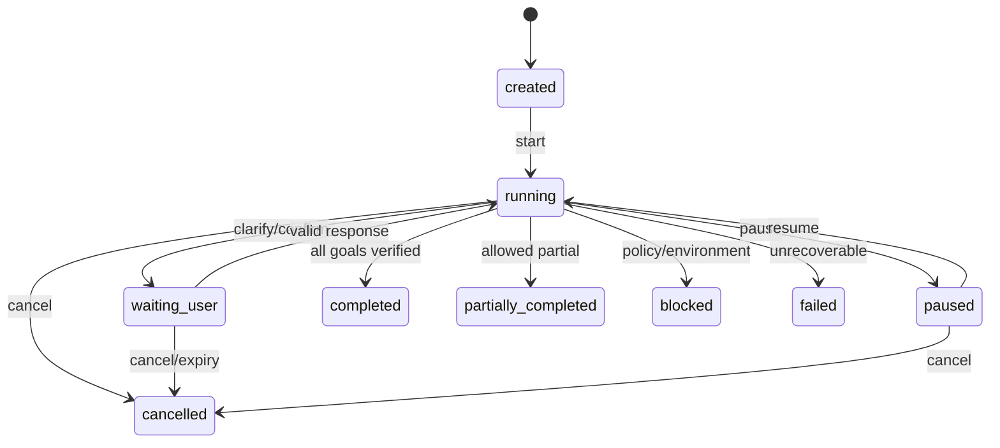
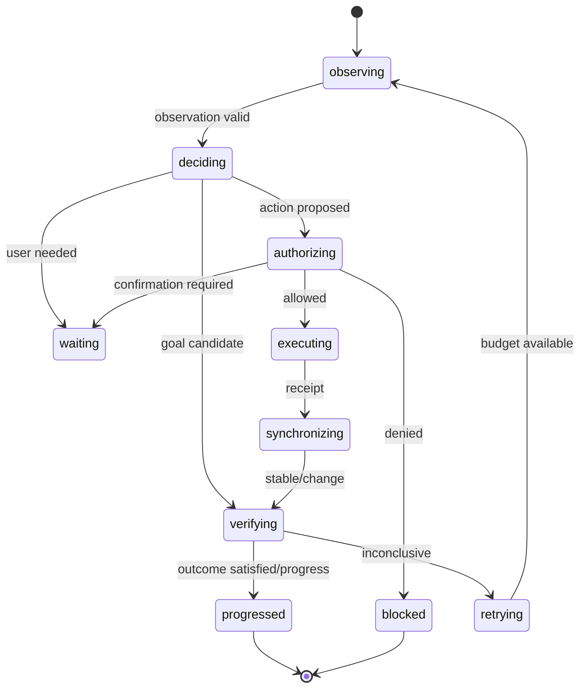

# Modelo de domínio e máquinas de estado

## 1. Entidades principais

### TaskContract

```typescript
interface TaskContract {
  taskId: string
  request: string
  goals: GoalContract[]
  constraints: TaskConstraint[]
  allowedCapabilities: Capability[]
  completionPolicy: 'all_required' | 'explicit_partial_allowed'
  createdAt: string
}
```

O texto do usuário é preservado, mas a execução opera sobre goals/constraints. Interpretação incompleta deve ser representada como questão aberta, não preenchida por suposição silenciosa.

### Session

```typescript
interface Session {
  sessionId: string
  owner: SessionOwner
  task: TaskContract
  status: SessionStatus
  revision: number
  budgets: ExecutionBudgets
  browserScope: BrowserScope
  currentGoalId?: string
  pendingConfirmation?: PendingConfirmation
  createdAt: string
  updatedAt: string
}
```

### GoalContract

```typescript
interface GoalContract {
  goalId: string
  description: string
  required: boolean
  outcome: OutcomeContract
  status: 'pending' | 'active' | 'satisfied' | 'blocked' | 'failed' | 'skipped'
  evidenceIds: string[]
}
```

### PageObservation

```typescript
interface PageObservation {
  observationId: string
  sessionId: string
  tabId: string
  documentId: string
  revision: number
  capturedAt: string
  page: PageDescriptor
  viewport: ViewportDescriptor
  regions: PageRegion[]
  elements: ObservedElement[]
  signals: BrowserSignal[]
  sanitization: SanitizationSummary
}
```

### ElementRef

```typescript
interface ElementRef {
  kind: 'element'
  sessionId: string
  tabId: string
  documentId: string
  observationId: string
  revision: number
  localId: string
  fingerprint: string
}
```

`localId` pode mapear internamente ao highlight index, mas consumers não podem tratar o índice como identidade.

### Candidate

```typescript
interface Candidate<TAction extends ActionName = ActionName> {
  candidateId: string
  observationId: string
  action: TAction
  target?: ElementRef
  args: CandidateArgs<TAction>
  semanticLabel: string
  regionId?: string
  deterministicSignals: CandidateSignal[]
  risk: RiskAssessment
}
```

### DecisionResult

```typescript
type DecisionResult =
  | { kind: 'action'; candidateId: string; provider: ProviderId; confidence?: number; evidence: DecisionEvidence[] }
  | { kind: 'observe'; scope: ObservationScope; reason: string }
  | { kind: 'clarify'; question: UserQuestion; reason: string }
  | { kind: 'confirm'; request: ConfirmationRequest; reason: string }
  | { kind: 'replan'; reason: string; provider: ProviderId }
  | { kind: 'goal_satisfied'; goalId: string; evidenceIds: string[] }
  | { kind: 'blocked'; reason: BlockReason }
  | { kind: 'failed'; error: RuntimeError }
```

Não existe `finished` baseado apenas na palavra de um provider. `goal_satisfied` ainda passa pelo verificador e pelas regras globais.

### ActionReceipt

```typescript
interface ActionReceipt {
  actionId: string
  sessionId: string
  candidateId: string
  startedAt: string
  endedAt: string
  status: 'executed' | 'rejected' | 'cancelled' | 'failed'
  result?: ActionResult
  error?: RuntimeError
  observedSignals: BrowserSignal[]
}
```

### Evidence

```typescript
interface Evidence {
  evidenceId: string
  type: EvidenceType
  source: 'browser' | 'policy' | 'user' | 'jev' | 'deterministic' | 'generative'
  observationId?: string
  actionId?: string
  value: JsonValue
  capturedAt: string
  sensitivity: 'public' | 'internal' | 'sensitive' | 'secret'
}
```

## 2. Máquina de estados da sessão



### Regras

- Transições terminais são imutáveis.
- `completed` exige todos os goals `required` em `satisfied`.
- `partially_completed` exige policy explícita e lista de goals não satisfeitos.
- `waiting_user` conserva budgets de step e suspende apenas os timeouts configurados como pausáveis.
- `resume` exige que o Browser Scope ainda seja válido; caso contrário volta por reobservação.

## 3. Máquina de estados de um step



## 4. Máquina de estados da referência

Uma `ElementRef` é:

- `fresh`: mesma sessão/aba/documento/revisão e fingerprint compatível;
- `revalidated`: revisão mudou, mas resolução determinística confirmou equivalência permitida;
- `stale`: documento, aba, ownership ou fingerprint mudou;
- `missing`: target não existe;
- `forbidden`: target existe, mas policy/capability impede ação.

Por padrão, ações mutativas exigem `fresh`. Revalidation pode ser usada para ações de leitura/reversíveis quando definida pela Action Definition.

## 5. Máquina de confirmação

```typescript
interface PendingConfirmation {
  confirmationId: string
  sessionId: string
  actionId: string
  targetDigest: string
  argsDigest: string
  observationRevision: number
  expiresAt: string
  status: 'pending' | 'approved' | 'denied' | 'expired' | 'invalidated'
}
```

Uma aprovação só é válida se todos os digests e a revisão continuarem compatíveis. Replanejar argumentos, trocar aba ou alterar target invalida a confirmação.

## 6. Budgets

```typescript
interface ExecutionBudgets {
  maxSteps: number
  maxElapsedMs: number
  maxActions: number
  maxConsecutiveNoProgress: number
  maxProviderCalls: Partial<Record<ProviderId, number>>
  maxRetriesPerErrorCode: Record<string, number>
  maxTabs: number
}
```

Budgets são aplicados por código. Jev não conta steps/tokens/tempo.

## 7. Idempotência

- comandos de controle têm `commandId` e podem ser reentregues;
- executor registra `actionId` antes de efeito externo quando possível;
- uma resposta duplicada não executa ação novamente;
- transições usam `expectedRevision` para compare-and-set;
- mensagens remotas carregam `requestId`, `sessionId` e `protocolVersion`;
- eventos têm `eventId` monotônico por sessão.

## 8. Erros de domínio

```typescript
type RuntimeErrorCode =
  | 'STALE_REFERENCE'
  | 'TARGET_NOT_FOUND'
  | 'TAB_UNAVAILABLE'
  | 'DOCUMENT_CHANGED'
  | 'PERMISSION_DENIED'
  | 'CONFIRMATION_REQUIRED'
  | 'CONFIRMATION_INVALID'
  | 'POLICY_BLOCKED'
  | 'PROVIDER_TIMEOUT'
  | 'PROVIDER_RATE_LIMITED'
  | 'PROVIDER_INVALID_RESPONSE'
  | 'TRANSPORT_UNAVAILABLE'
  | 'PROTOCOL_MISMATCH'
  | 'SYNC_TIMEOUT'
  | 'NO_PROGRESS'
  | 'BUDGET_EXCEEDED'
  | 'CANCELLED'
  | 'INTERNAL'
```

Mensagens humanas são derivadas de códigos e contexto sanitizado; o código de controle não faz branching em texto de erro.
