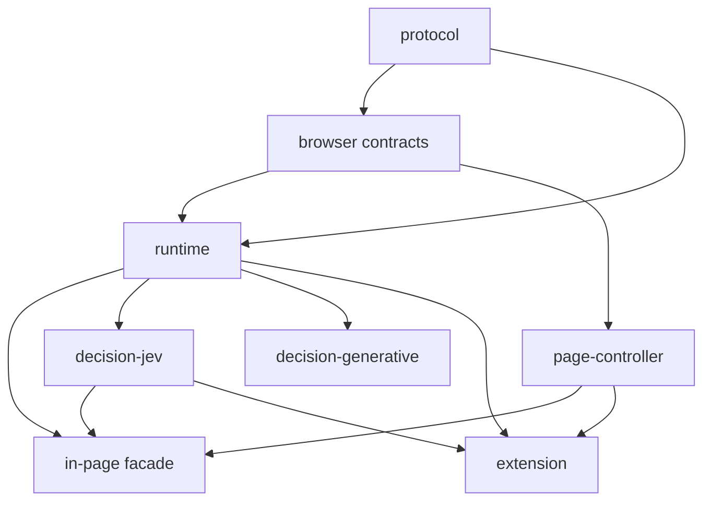

# Limites de pacotes e dependências

## 1. Pacotes propostos

| Pacote | Responsabilidade | Publicável |
|---|---|---|
| `@page-agent/protocol` | Tipos wire-safe, schemas e versões de protocolo. | Sim |
| `@page-agent/runtime` | Máquina de sessão/step, ports, outcomes e políticas abstratas. | Sim |
| `@page-agent/browser` | Contrato Browser Runtime e tipos de observação/ação. | Sim |
| `@page-agent/page-controller` | Implementação local DOM e extração. | Sim |
| `@page-agent/decision-jev` | Jev provider e transportes. | Sim/opcional |
| `@page-agent/decision-generative` | Provider generativo e adapters OpenAI-compatible. | Sim/opcional |
| `@page-agent/in-page` | Composição local, facade e UI embutida. | Sim |
| `@page-agent/ui` | Views/painel agnósticos de provider. | Sim |
| `@page-agent/ext` | Adapters Chrome, runner, side panel, content scripts. | Não/artefato |
| `@page-agent/evals` | Fixtures, benchmarks e relatórios. | Não |
| `@page-agent/e2e` | Playwright/Chrome extension E2E. | Não |

O nome público `page-agent` pode reexportar `@page-agent/in-page` para manter ergonomia.

## 2. Grafo permitido



As setas representam “é consumido por”; o runtime conhece interfaces de providers, não implementações concretas. Na prática, providers concretos dependem dos tipos do runtime, e facades compõem tudo por dependency injection.

## 3. Regras de importação

- `runtime` NÃO DEVE importar `decision-jev`, `decision-generative`, `page-controller`, React, WXT ou Chrome.
- `browser` NÃO DEVE importar providers.
- `page-controller` NÃO DEVE importar runtime ou providers.
- `decision-jev` NÃO DEVE importar DOM/Chrome/UI.
- `extension` PODE importar runtime, browser, protocol, page-controller e providers configurados.
- content script NÃO DEVE importar Agent Runtime nem providers; somente PageController/protocol.
- main world NÃO DEVE importar runtime, provider ou secrets; somente cliente de API pública.
- UI NÃO DEVE interpretar mensagens de provider bruto; consome projeções do Session/Event Store.
- adaptador de compatibilidade PODE importar API nova; API nova NÃO PODE importar o adaptador.

## 4. Submódulos sugeridos

```text
packages/runtime/src/
├── session/
├── task/
├── loop/
├── decisions/
├── policies/
├── actions/
├── outcomes/
├── events/
└── errors/

packages/browser/src/
├── observation/
├── elements/
├── actions/
├── tabs/
├── synchronization/
└── BrowserRuntime.ts

packages/decision-jev/src/
├── JevDecisionProvider.ts
├── questions/
├── projections/
├── gates/
└── transports/
```

## 5. Ports de dependency injection

```typescript
interface RuntimeDependencies {
  browser: BrowserRuntime
  decisions: DecisionRouter
  policy: PolicyEngine
  sessions: SessionStore
  clock: Clock
  ids: IdGenerator
  events: EventSink
  sanitizer: DataSanitizer
}
```

Relógio e IDs injetáveis permitem testes determinísticos. Nenhum singleton global deve carregar estado de sessão.

## 6. Guardas automatizadas

CI deve incluir:

- checagem de ciclos (por exemplo, dependency-cruiser/madge configurado);
- ESLint `no-restricted-imports` por pacote;
- verificação de que `any` não entra em exports públicos/protocol;
- build browser sem polyfills Node;
- bundle check garantindo que SDK Node do Jev não vaze para content script;
- API Extractor/tsd para contratos públicos;
- teste de que todos os message schemas possuem versão e union discriminada.

## 7. Estratégia de transição de pacotes

1. Criar `protocol`, `browser` e `runtime` sem alterar entrypoints atuais.
2. Adaptar PageController ao novo contrato por wrapper temporário.
3. Entregar vertical slice in-page novo.
4. Entregar remote adapter e runner da extensão.
5. Mover LLM antigo para `decision-generative`.
6. Migrar facades/UI/API.
7. Remover `PageAgentCore`, MacroTool, prompts antigos e wrappers temporários.

Wrappers temporários devem ficar em `compat/` com issue e versão de remoção; nunca dentro dos domínios novos.
