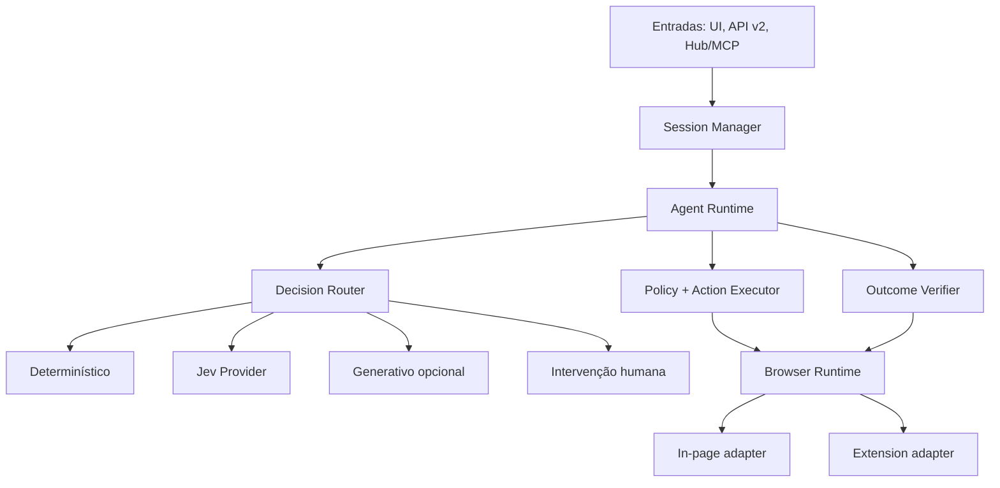
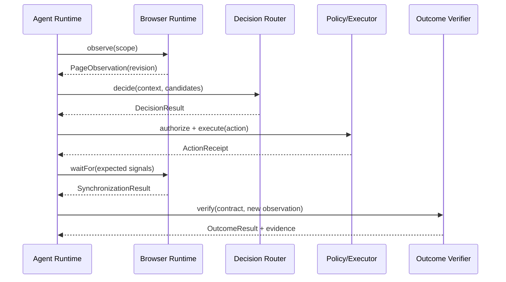

# Arquitetura-alvo

## 1. Visão geral

O runtime é uma máquina de estados. Providers nunca chamam DOM diretamente. Eles recebem snapshots/candidatos e retornam decisões tipadas. Policy e Executor permanecem entre decisão e efeito.

## 2. Componentes e responsabilidades

### Session Manager

- cria e identifica sessões;
- garante política de concorrência;
- vincula owner, capabilities e abas;
- persiste checkpoints mínimos;
- recebe confirmações e comandos de controle;
- fornece event stream a múltiplos observadores;
- entrega exatamente um resultado terminal.

Não interpreta DOM, não seleciona ação e não chama Jev.

### Agent Runtime

- conduz loop incremental;
- mantém objetivo atual e budgets;
- solicita observação;
- produz Decision Context;
- chama Decision Router;
- submete proposta à policy;
- executa e sincroniza;
- verifica outcome;
- decide avançar, retry, reobservar, replanejar, perguntar ou terminar.

### Browser Runtime

Porta que abstrai ambiente local/remoto:

- `observe(scope, signal)`;
- `execute(action, signal)`;
- `waitFor(changeSet, signal)`;
- `tabs.*` quando capability disponível;
- `subscribe(signals)`;
- `dispose()`.

O core não usa `window`, `document` ou `chrome.*`.

### Observation Pipeline

- coleta árvore DOM e sinais do documento;
- produz schema canônico;
- atribui `documentId` e `revision`;
- aplica sanitização;
- cria regiões e candidatos;
- projeta estado mínimo por pergunta/provider.

### Decision Router

Roteia cada necessidade de decisão:

| Condição | Mecanismo |
|---|---|
| Resultado completamente determinado por dados/regras | Determinístico |
| Escolha semântica entre opções conhecidas | Jev `Choice` |
| Julgamento binário | Jev `Noul` |
| Avaliação ordinal | Jev `Score` |
| Geração/replanejamento aberto | Generativo opcional |
| Informação/autorização ausente | Humano |

### Policy Engine

- verifica capability, domínio, risk tier e estado;
- valida confirmação;
- bloqueia argumentos/targets proibidos;
- aplica limites de volume/frequência;
- nunca usa um provider de IA para autorizar.

### Action Executor

- resolve Action Definition;
- revalida target ref;
- executa exatamente uma ação;
- captura timestamps e resultado estruturado;
- não decide a próxima ação.

### Synchronization Coordinator

- transforma a ação em sinais esperados;
- observa navegação, mutações, valores e tab events;
- termina por `satisfied`, `stabilized`, `timeout`, `cancelled` ou `error`;
- usa espera adaptativa somente como fallback documentado.

### Outcome Verifier

- avalia predicados determinísticos primeiro;
- coleta evidências;
- pode usar Jev apenas para interpretar sinais semânticos residuais;
- produz `satisfied`, `unsatisfied`, `inconclusive` ou `violated`;
- controla conclusão de etapa/tarefa.

### Providers

Providers são adapters puros do ponto de vista do runtime:

- recebem contexto imutável;
- respeitam `AbortSignal`;
- retornam union discriminada;
- não executam ações;
- não alteram sessão;
- não registram segredos em logs.

## 3. Fluxo de um step

Um step pode não executar ação quando:

- decisão determina que já está concluído;
- é necessário pedir informação;
- policy exige confirmação;
- não há candidato adequado;
- budget/timeout foi atingido;
- estado foi invalidado e precisa ser observado novamente.

## 4. Fluxo de conclusão

1. Task Planner/Interpreter cria `TaskContract` inicial.
2. Runtime acumula evidências por objetivo.
3. Quando todos os objetivos obrigatórios estão `satisfied`, Outcome Verifier emite candidato a conclusão.
4. Runtime verifica invariantes globais e ausência de efeitos pendentes.
5. Session Manager grava resultado terminal.
6. Texto de resposta pode ser gerado por formatter determinístico ou provider generativo, mas não altera status.

## 5. Invariantes arquiteturais

- Existe exatamente um `AgentRuntime` por sessão ativa.
- Um `DecisionResult.action` aponta para `candidateId` existente na mesma revisão.
- Nenhuma ação externa é executada antes de policy approval.
- Uma `ElementRef` nunca atravessa mudança de `documentId`.
- Apenas o Outcome Verifier pode satisfazer um objetivo automaticamente.
- `SessionResult` terminal é imutável.
- Nenhum provider conhece `PageController` ou `chrome.*`.
- Nenhum content script possui credencial de provider.
- Service worker é roteador stateless/idempotente, não coordenador da sessão.
- Os adapters local e remoto passam a mesma suíte de contrato.

## 6. Falhas e recuperação

| Falha | Comportamento |
|---|---|
| Stale ref | Não executar; reobservar e reconstruir candidatos. |
| Aba fechada | Invalidar ownership; selecionar fallback permitido ou bloquear. |
| Documento navegou | Novo `documentId`; cancelar waits antigos. |
| Jev timeout/rate limit | Retry técnico limitado; fallback conforme policy. |
| Jev baixa confiança | Não agir; refinar estado, confirmar, generativo ou humano. |
| Provider generativo inválido | Rejeitar schema; não executar output bruto. |
| Protocolo incompatível | Falhar com erro versionado; nunca interpretar parcialmente. |
| Sem progresso | Alternativa limitada; depois replan/needs_input/failed. |
| SW reiniciado | Reconstituir transporte; runner/session store mantém checkpoint. |

## 7. Escolhas deliberadas

- Planejamento é incremental, não uma lista rígida completa.
- Candidate generation é progressiva: operação → região → elementos → argumentos.
- Jev não recebe centenas de combinações `ação × elemento` sem filtro.
- Confiança não concede autoridade; apenas afeta roteamento.
- Histórico interno é estruturado; views textuais são projeções.
- API pública usa eventos tipados e session IDs.
- Compatibilidade antiga vive fora do runtime.

## 8. Critérios arquiteturais de aceite

- Remover dependência `runtime/core → @page-agent/llms`.
- Compilar runtime em ambiente browser sem Node polyfills.
- Executar a mesma tarefa de fixture em local e extension adapters.
- Provar por teste que stale ref não alcança executor DOM.
- Provar por teste que `done` de provider não conclui tarefa.
- Provar por teste que ação sensível não executa sem confirmation token válido.
- Provar por teste que restart do SW não cria nova sessão nem duplica ação.
