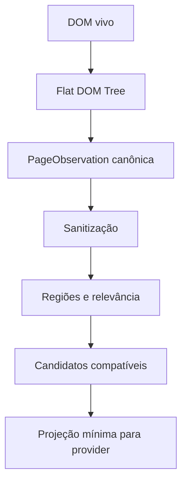

# Observação, redução de estado e geração de candidatos

## 1. Pipeline



## 2. ObservedElement

```typescript
interface ObservedElement {
  ref: ElementRef
  tag: string
  role?: string
  accessibleName?: string
  text?: string
  description?: string
  inputType?: string
  valueState?: 'empty' | 'present' | 'masked'
  placeholder?: string
  options?: ObservedOption[]
  attributes: Record<string, string>
  state: {
    visible: boolean
    enabled: boolean
    editable: boolean
    checked?: boolean
    expanded?: boolean
    selected?: boolean
  }
  geometry?: NormalizedRect
  regionId: string
  supportedActions: ActionName[]
  sensitivity: SensitivityTag[]
}
```

Valores secretos não entram em `text/value`; usa-se `valueState`.

## 3. Revisões

- `revision` incrementa quando a projeção relevante muda.
- Mutações cosméticas irrelevantes podem ser coalescidas.
- `observationId` é novo a cada snapshot retornado.
- Candidate IDs são derivados/registrados dentro da observação e expiram com ela.
- O executor recebe `expectedRevision` e revalida.

## 4. Regiões

Regiões ajudam a evitar estado irrelevante:

- dialog/modal ativa;
- formulário principal;
- navegação/menu;
- tabela/lista;
- área de resultados;
- header/footer;
- viewport e entorno;
- elemento alvo e ancestrais.

Heurísticas determinísticas priorizam:

1. modal/focus trap atual;
2. região contendo último target/outcome esperado;
3. labels/texto correspondentes ao goal;
4. viewport;
5. expansão progressiva.

## 5. Candidate generation progressiva

### Fase A — operação

Determinar se o próximo passo é:

- observar/esperar;
- click;
- input;
- select;
- scroll;
- tab operation;
- clarify/confirm;
- verify/finish.

Quando o tipo é determinado por código (por exemplo, há texto fornecido e um campo vazio correspondente), não consultar Jev para “inventar” outro tipo.

### Fase B — compatibilidade

Filtrar elementos por:

- `supportedActions`;
- visible/enabled/editable;
- role/input type;
- região;
- policy/capability;
- sensibilidade;
- ownership da aba/documento.

### Fase C — relevância

Score determinístico semântico leve:

- match de accessible name/label/texto;
- proximidade com texto do objetivo;
- associação label→control;
- form/dialog ancestry;
- histórico de targets já tentados;
- estado do campo;
- outcome esperado.

Esse score serve para reduzir/priorizar, não para decidir sozinho quando ambíguo.

### Fase D — seleção Jev

Enviar candidatos remanescentes com IDs opacos e descrições completas. Não enviar somente índices.

### Fase E — argumentos

- recuperar valores literais do Task Contract;
- normalizar por código;
- escolher opção fechada;
- solicitar geração apenas quando necessário;
- bloquear secrets ausentes em vez de inferir.

## 6. Limites de candidatos

Embora Choice aceite até 255 opções, o runtime não deve usar o máximo como padrão. Objetivos:

- ideal: 3–30 candidatos semanticamente plausíveis;
- 31–100: exigir justificativa/telemetria;
- >100: usar região/hierarquia/beam search;
- nunca truncar arbitrariamente sem alternativa `none` e estratégia de expansão.

## 7. Projeção Jev

Exemplo:

```json
{
  "goal": "Advance to checkout using the primary continue control.",
  "page": {
    "title": "Cart",
    "url_host": "shop.example"
  },
  "region": {
    "kind": "main",
    "summary": "Cart summary with totals and actions"
  },
  "candidates": [
    {
      "id": "c_01",
      "action": "click",
      "role": "button",
      "name": "Continue to checkout",
      "nearby_text": "Total R$ 120,00"
    },
    {
      "id": "c_02",
      "action": "click",
      "role": "link",
      "name": "Continue shopping"
    }
  ]
}
```

O mapa `candidateId → ElementRef/action` permanece local e nunca é reconstruído a partir da resposta do provider.

## 8. Data minimization

Antes de provider:

- remover password/token/secret values;
- substituir PII por placeholders quando sem relevância;
- excluir DOM oculto/telemetria/scripts/styles;
- não enviar cookies, storage ou headers;
- limitar texto de regiões não selecionadas;
- registrar apenas resumo de sanitização, não o segredo removido.

## 9. Casos especiais

### Virtualized lists

Elementos fora da janela não existem no DOM. Runtime deve scroll/observar por páginas, deduplicar fingerprints e respeitar budget.

### Shadow DOM e iframes

- suporte precisa ser capability explícita;
- cada frame pode possuir `frameId` no ref;
- cross-origin frames podem ser não observáveis e devem gerar `CAPABILITY_UNAVAILABLE`.

### Canvas/custom controls

Sem VLM, tratar como não suportado, a menos que acessibilidade/DOM exponha controles. Não gerar coordenadas por suposição.

## 10. Testes

- candidate filter por action compatibility;
- região modal domina página subjacente;
- labels e accessible names;
- secrets mascarados;
- candidates expiram por revision;
- listas >255 usam hierarquia;
- `none` permite expansão;
- DOM adversarial não entra em instructions;
- páginas PT-BR preservam semântica;
- virtualized list sem duplicar ação.
