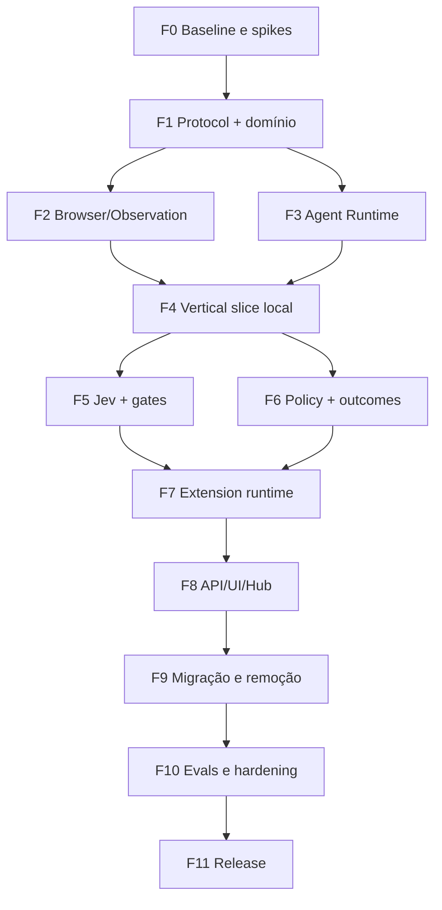

# Plano completo de implementação

## 1. Estratégia

A migração será feita por vertical slices, mantendo a branch principal compilável. Não será criado um segundo produto completo ao lado do primeiro. Componentes novos entram por contracts/adapters; quando alcançam paridade testada, substituem o caminho antigo e o legado correspondente é removido.

Princípios de execução:

- contratos e schemas antes dos adapters;
- local runtime antes do remote runtime;
- Jev provider validado antes de torná-lo default;
- Outcome Verifier antes de remover `done`;
- Session Manager antes de consolidar entrypoints da extensão;
- compatibilidade apenas na borda;
- cada fase possui exit gate mensurável.

## 2. Fases e dependências

## 3. Fase 0 — baseline e spikes

### Objetivo

Congelar a referência, medir o comportamento atual e resolver hipóteses que mudam a arquitetura.

### Entregas

- tag/branch do baseline 1.12.4;
- relatório automatizado de build/test/lint/typecheck;
- 15–30 tarefas E2E reproduzíveis do Page Agent atual;
- spike Jev HTTP no browser/extension;
- spike de runner lifecycle com side panel/SW;
- spike de ElementRef/fingerprint em SPA;
- decisão de modo de credencial inicial;
- primeira versão do threat model ratificada.

### Exit gate

- nenhum bloqueio sem owner/decisão;
- transport Jev selecionado para MVP;
- host do runtime da extensão selecionado;
- métricas baseline coletadas.

## 4. Fase 1 — protocolo, domínio e skeleton

### Objetivo

Criar contracts estáveis e packages sem efeito de produção.

### Entregas

- `@page-agent/protocol` com schemas wire-safe;
- `@page-agent/browser` com observação, refs, actions e errors;
- `@page-agent/runtime` com domain types/state machines;
- IDs/clocks/event sink injetáveis;
- Session Store in-memory;
- guardas de import/ciclos;
- contract/API tests.

### Exit gate

- packages compilam sem DOM/Chrome/Node indevidos;
- 100% das unions P0 têm exhaustive checks;
- schemas serializam/deserializam fixtures;
- runtime skeleton percorre uma sessão fake até terminal.

## 5. Fase 2 — Browser Runtime e observação

### Objetivo

Evoluir PageController para schema canônico sem quebrar o caminho atual prematuramente.

### Entregas

- `PageObservation` estruturada;
- document/observation/revision IDs;
- `ElementRef` e fingerprint;
- ActionResult/BrowserError estruturados;
- LocalBrowserRuntime;
- sanitizer/redactor;
- CandidateGenerator progressivo;
- adapter temporário de BrowserState textual para testes antigos.

### Exit gate

- ações atuais passam pela nova ref;
- stale refs recusadas em testes;
- projection textual mantém qualidade do demo atual;
- secrets fixtures nunca aparecem na saída sanitizada;
- performance dentro do budget inicial.

## 6. Fase 3 — Agent Runtime

### Objetivo

Implementar loop provider-agnostic com fake/deterministic providers.

### Entregas

- Session/Goal managers;
- state machines;
- Decision Router;
- deterministic provider;
- action pipeline;
- budgets/cancel;
- Progress Tracker/cycle detection;
- event log;
- Outcome Verifier mínimo.

### Exit gate

- tarefa fixture determinística completa sem `@page-agent/llms`;
- cancelamento testado em todas as boundaries;
- provider não executa ação;
- conclusão somente com evidence.

## 7. Fase 4 — vertical slice local

### Objetivo

Provar o desenho fim a fim em página fixture antes de adicionar Jev/extensão.

### Cenários

- localizar campo por label;
- preencher literal;
- selecionar opção;
- clicar continuar;
- aguardar mudança DOM/URL;
- verificar resultado;
- pedir confirmação para submit simulado;
- takeover e resume.

### Exit gate

- E2E local sem LLM;
- events/UI projection coerentes;
- nenhuma espera fixa necessária no fluxo normal;
- false completion fixtures falham corretamente.

## 8. Fase 5 — Jev provider

### Objetivo

Adicionar decisões semânticas fechadas, medir precisão e calibrar gates.

### Entregas

- JevTransport selecionado(s);
- templates versionados;
- Choice/Noul/Score adapters;
- batch planner;
- threshold policy;
- language policy;
- retries/circuit breaker;
- mocks/replay;
- eval runner e dataset inicial.

### Exit gate

- selection accuracy mínima definida por risk tier;
- PT-BR testado;
- provider indisponível produz fallback explícito;
- nenhum raw candidate mapping sai do runtime;
- thresholds carregados de config versionada.

## 9. Fase 6 — policy, outcomes e generativo opcional

### Objetivo

Completar segurança e tarefas que exigem geração.

### Entregas

- Action Registry final MVP;
- Risk Classifier e Policy Engine;
- confirmation tokens;
- Outcome Contract DSL;
- semantic outcome checks;
- idempotency/effect_unknown;
- GenerativeProvider adapter e migração do cliente LLM;
- replan/value generation flows.

### Exit gate

- R3 nunca executa sem confirmação;
- effect_unknown não gera retry cego;
- generative disabled funciona para Jev-fit tasks;
- output generativo inválido não alcança ação;
- threat tests P0 verdes.

## 10. Fase 7 — runtime da extensão

### Objetivo

Substituir `MultiPageAgent`/RemotePageController antigos pelo runtime compartilhado.

### Entregas

- runner/lease/recovery;
- IndexedDB Session Store;
- protocol v2;
- content handshake/document IDs;
- ExtensionBrowserRuntime;
- typed DOM/Tab RPC;
- tab ownership;
- event-driven mask/takeover;
- restart/reconnect handling;
- contract suite local vs remote.

### Exit gate

- mesmos E2E do vertical slice passam na extensão;
- side panel fechar não cria/corrompe sessão;
- SW restart recupera transporte;
- nenhuma credencial no content/main-world;
- nenhuma mensagem `any/null` no protocolo.

## 11. Fase 8 — APIs, UI, Hub/MCP

### Objetivo

Migrar todos os entrypoints para Session Manager.

### Entregas

- API in-page v2;
- extension API v2 + grants;
- side panel orientado a session events;
- confirmações e timeline;
- Hub/MCP como clients;
- compat-v1 fino;
- docs/examples.

### Exit gate

- side panel, API externa e Hub observam a mesma sessão;
- origin não autorizado é recusado;
- UI acessível e stop sempre disponível;
- compat tests verdes.

## 12. Fase 9 — migração e remoção

### Objetivo

Eliminar a arquitetura antiga e dependências obsoletas.

### Remoções

- `PageAgentCore` antigo;
- MacroTool e reflection types;
- prompts ReAct antigos;
- `done` tool;
- `MultiPageAgent extends PageAgentCore`;
- RemotePageController antigo;
- globals `isAgentRunning/currentTabId` como verdade;
- polling de mask antigo;
- `execute_javascript` público;
- autoFixer de tool calls se não usado pelo generativo;
- docs/config flags antigas sem função.

### Exit gate

- `rg`/dependency check não encontra imports proibidos;
- um único loop de produção;
- build completo/testes/E2E verdes;
- bundle sem código antigo;
- migration guide publicado.

## 13. Fase 10 — avaliação e hardening

### Objetivo

Provar qualidade em páginas reais e condições adversas.

### Entregas

- benchmark comparativo baseline/Jev/híbrido;
- calibration report;
- chaos tests de transport/SW/tab;
- soak/memory/perf;
- security review/pentest;
- privacy review;
- accessibility audit;
- release candidate.

### Exit gate

- critérios em `ACCEPTANCE_AND_DEFINITION_OF_DONE.md` atendidos;
- nenhum P0 aberto;
- regressões justificadas/aceitas;
- rollback testado.

## 14. Fase 11 — release e estabilização

### Estratégia

1. internal/dev channel;
2. alpha com telemetry opt-in e site allowlist;
3. beta com feature flag Jev default para task families aprovadas;
4. stable gradual;
5. desativação do compat v1 em major posterior.

## 15. Paralelização segura

Após F1, podem ocorrer em paralelo:

- PageController/Observation;
- Agent Runtime/state machines;
- Jev transport/templates (com mocks);
- UI design/event projections;
- E2E harness/fixtures;
- threat model/security tests.

Não paralelizar sem contrato:

- remote protocol antes de schemas;
- UI final antes de public events;
- remoção de core antes da vertical slice;
- threshold tuning antes do dataset.

## 16. Estimativa por complexidade

Não há datas absolutas sem conhecer equipe/capacidade. Complexidade relativa:

| Fase | Complexidade | Risco |
|---|---|---|
| F0 | M | Alto por hipóteses externas |
| F1 | M | Médio |
| F2 | L | Alto por DOM/stale refs |
| F3 | L | Alto por estado/cancelamento |
| F4 | M | Médio |
| F5 | L | Alto por comportamento Jev |
| F6 | L | Alto por segurança/outcomes |
| F7 | XL | Muito alto por MV3/múltiplos contextos |
| F8 | L | Alto por compat/UX |
| F9 | M | Médio |
| F10 | L | Alto por evidência real |
| F11 | M | Médio |

## 17. Gestão de mudanças

- cada fase produz ADRs/updates;
- todo PR referencia TASK/REQ/TEST;
- feature flags têm owner e data de remoção;
- merge não pode reduzir safety gate;
- métricas baseline são preservadas para comparação;
- upgrades do Page Agent upstream ou Jev exigem avaliação de impacto.
